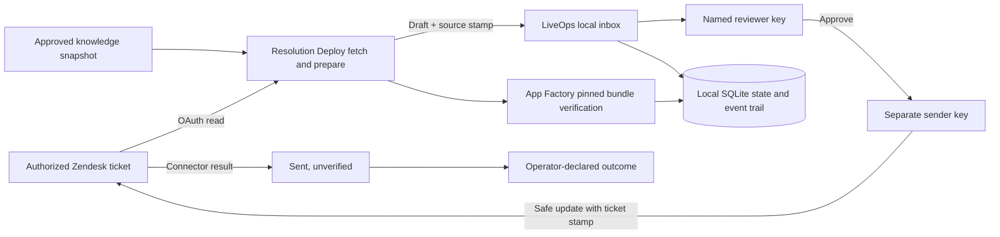
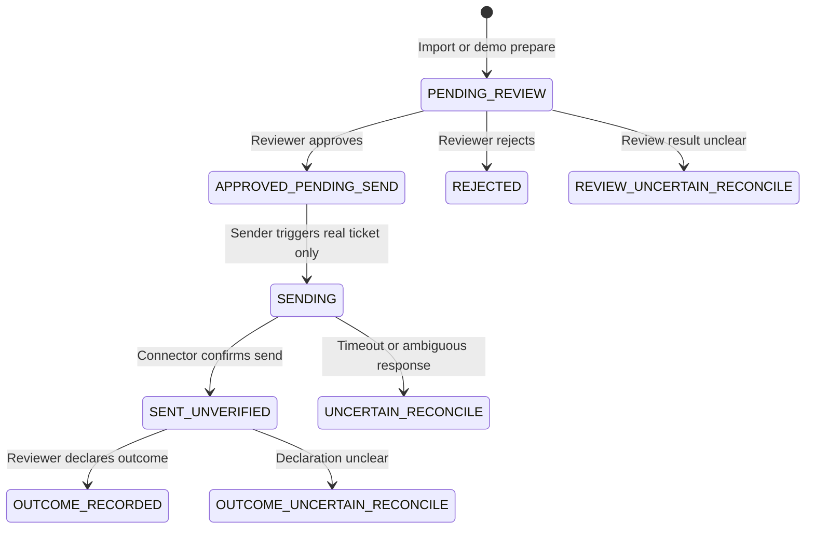
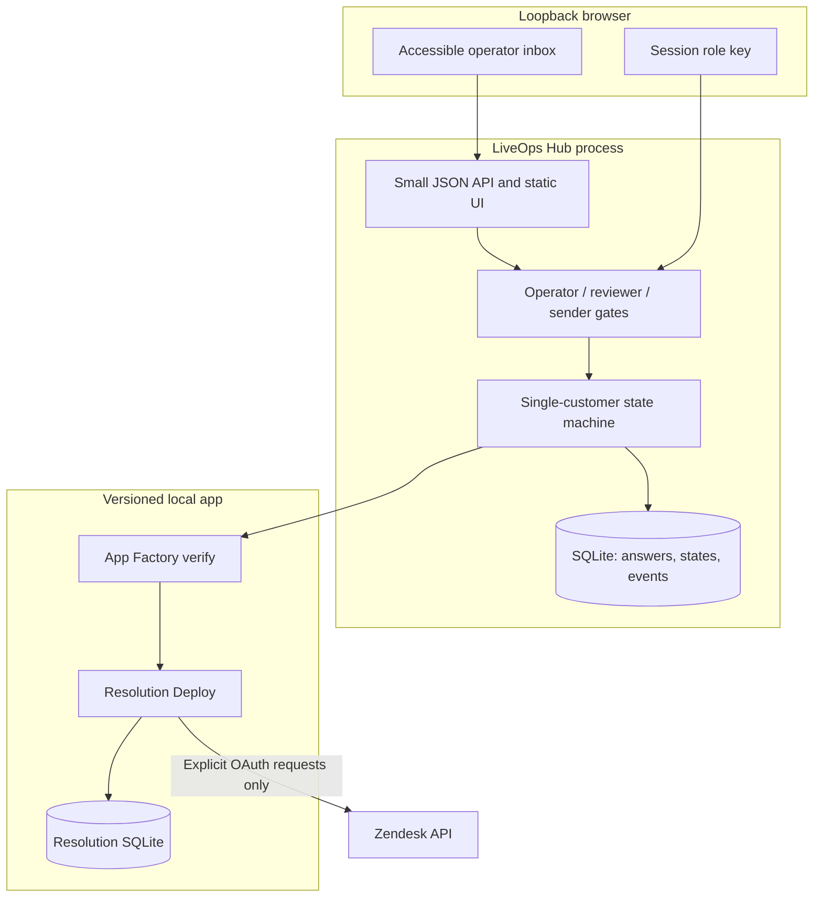

# A2Z LiveOps Hub

A local, customer-scoped operator console for the [A2Z Resolution Deploy](https://github.com/AAH20/a2z-resolution-engine) app, installed and pinned through [A2Z Agent App Factory](https://github.com/AAH20/a2z-agent-app-factory). Its first workflow is Zendesk support: prepare a draft from approved knowledge, require a named human review, then require a separate send action. A later outcome is an **operator declaration**, never a verified customer resolution.

**Current status:** inspectable local pilot. The included UI, state machine, tests, and synthetic demo work offline after installing the pinned app. No customer account, OAuth token, or live Zendesk deployment is provided. This project is not a hosted multi-tenant service and does not claim independently verified acceptance, revenue, or production readiness.



The Hub calls only the verified installed app through argument arrays. App Factory checks the bundle identity and source commit before each action. The underlying Resolution Deploy implementation keeps ticket identity as an HMAC and uses a Zendesk `safe_update` with the fetched ticket timestamp. The Hub additionally stores the prepared **answer text**, ticket ID, article reference, timestamps, and state in its local SQLite file so a reviewer can inspect the draft. Treat this file as customer data.

## Quick start: synthetic, offline

Python 3.11+ and `git` are required. The example uses the published source commit `5aa314fb1b2b24cb0a90d6b3a64d5af83b49c5c2`; inspect and update the pin intentionally when upgrading.

```bash
git clone https://github.com/AAH20/a2z-agent-app-factory.git
git clone https://github.com/AAH20/a2z-resolution-engine.git
git clone https://github.com/AAH20/a2z-liveops-hub.git
python3 -m pip install -e ./a2z-agent-app-factory -e ./a2z-liveops-hub
a2z-app pack a2z-agent-app-factory/apps/resolution-deploy.json a2z-resolution-engine --output /tmp/resolution.a2zapp
a2z-app install /tmp/resolution.a2zapp /tmp/resolution-installed
a2z-app verify /tmp/resolution-installed
```

Set **different** role keys, each at least 32 characters, and a Resolution Engine HMAC key. Use a private working directory for both databases. The UI stores the current role key in browser `sessionStorage`, and binds only to numeric loopback addresses.

```bash
export RESOLUTION_ENGINE_KEY='replace-with-at-least-32-random-characters'
export LIVEOPS_OPERATOR_KEY='replace-with-operator-random-secret-32chars'
export LIVEOPS_REVIEWER_KEY='replace-with-reviewer-random-secret-32chars'
export LIVEOPS_SENDER_KEY='replace-with-sender-random-secret-32chars'
mkdir -m 700 -p /tmp/a2z-liveops-private
a2z-liveops \
  --app-target /tmp/resolution-installed \
  --knowledge /tmp/resolution-installed/source/examples/knowledge.synthetic.json \
  --resolution-db /tmp/a2z-liveops-private/resolution.sqlite3 \
  --hub-db /tmp/a2z-liveops-private/hub.sqlite3 \
  --customer-key synthetic-pilot \
  --expected-commit 5aa314fb1b2b24cb0a90d6b3a64d5af83b49c5c2 \
  --demo-ticket /tmp/resolution-installed/source/examples/zendesk-ticket.synthetic.json \
  --reviewer-label reviewer-one --sender-label sender-one
```

Open `http://127.0.0.1:8791/`, enter the operator key, and select **Load synthetic demo**. Switch to the reviewer key to approve or reject. Synthetic drafts are marked and cannot be sent, including through the API. A real send requires a separately configured Zendesk subdomain and `ZENDESK_OAUTH_TOKEN`, plus an authorized live ticket. No automatic reply runs in the background.

## Workflow contract



All ambiguous action states stop further action. In particular, a failed or timed-out send is **not retried automatically**. Inspect the Zendesk ticket and the installed app's local state first. The prototype has no reconciliation UI or correction workflow; these are release blockers for production.

| Action | Role key | Evidence emitted | Limitation |
| --- | --- | --- | --- |
| Import Zendesk ticket | Operator | Draft, knowledge source, ticket source stamp | Requires account authorization and a relevant approved article |
| Review | Reviewer | Named approve/reject event | Reviewer identity is a configured label, not enterprise SSO |
| Send | Sender | `SENT_UNVERIFIED` connector result | No customer acceptance proof |
| Declare outcome | Reviewer | `ACCEPTED`, `REWORK`, or `UNRESOLVED` | Self-declared; not authenticated from customer |

`GET /api/summary` keeps `verified_accepted_resolutions` as `null`. Do not compute revenue, effectiveness, or ROI from these counts alone.

## Architecture and scope



There is no shared customer database, public listen address, background automation, password login, SSO, rate limiting, backup workflow, or distributed lock. One operator process and one customer scope per private working directory is the intended pilot shape. Browser access to the local machine is itself a trust boundary. Do not expose this process through a reverse proxy or tunnel.

## Production gates

Before any customer-facing production deployment: add enterprise identity and mutually exclusive human assignments, a durable encrypted data store and backup/restore tests, retention and deletion policies, ticket-content minimization, authenticated customer-outcome evidence, connector idempotency and reconciliation, concurrency across processes, key rotation, audit export, observability without customer text, load tests, formal security review, and a consented pilot. The commercial layer should be priced only after measuring operator time, connection cost, support burden, and independently verified accepted resolutions in that pilot.

## Development

```bash
python3 -m pip install -e .
python3 -m unittest discover -s tests -v
```

Apache-2.0. See [SECURITY.md](SECURITY.md) for data-handling and disclosure guidance.
